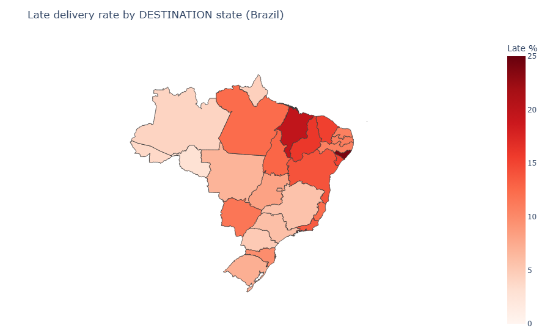
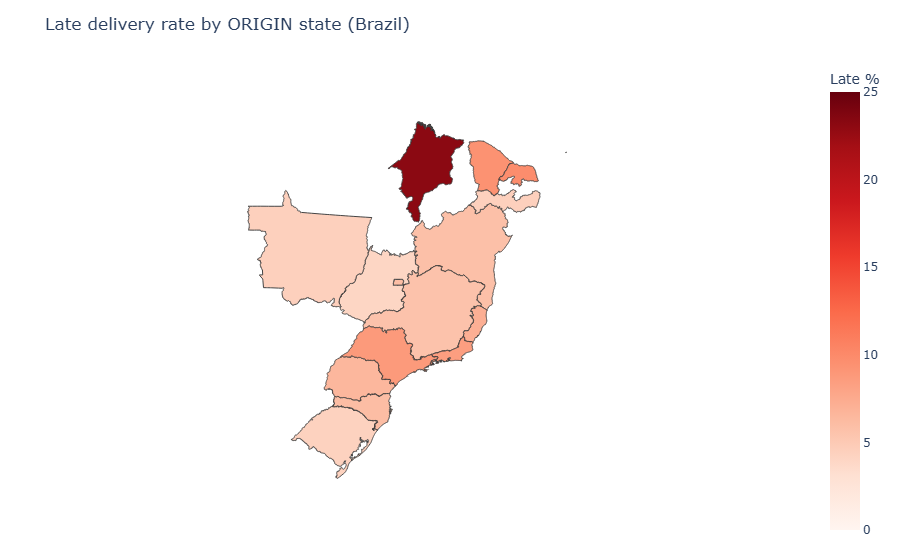
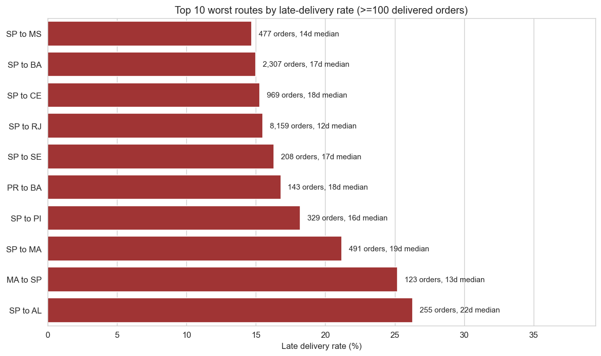
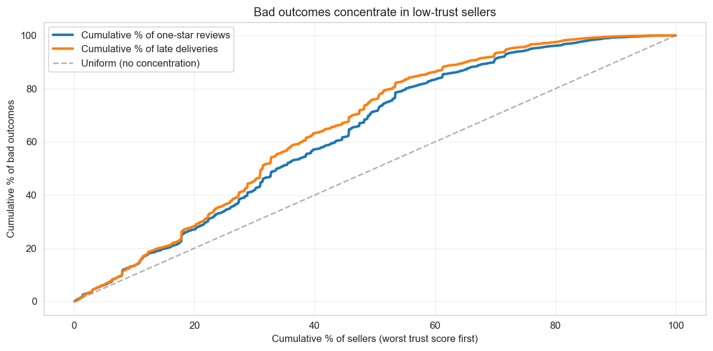

# Olist Marketplace Health Audit

A 5-day diagnostic audit of the Olist Brazilian e-commerce dataset, asking who actually destroys customer trust on a multi-seller marketplace: the platform, the sellers, or the logistics network.

The answer is logistics. Specifically, a small set of state-pair routes shipping out of São Paulo to the northeast.

## Headline findings

1. **Delivery timeliness drives 2.48x more variance in review scores than product category does.** One-star reviews are 10.6x more likely to be late than five-star reviews.
2. **Top 1% of state-pair routes drive 51% of all late deliveries.** Top 5% drive 80%. Top 10% drive 90%.
3. **The worst single route is São Paulo to Alagoas at 26.3% late, with a 22-day median delivery.** Seven of the ten worst routes originate from São Paulo.
4. **A custom Seller Trust Score** identifies that the bottom 10% of sellers handle 6% of orders but produce 13.4% of all one-star reviews (about 2.2x the bad-outcome rate of the average seller).

## The geographic story

The bad-shipping problem on Olist has a clear geographic signature. The five worst destination states for late delivery are all in the northeast: Alagoas (23.9%), Maranhão (19.7%), Piauí (16.0%), Ceará (15.3%), Sergipe (15.2%).



On the origin side, only 15 of Brazil's 27 states ship enough volume for a meaningful late rate. Maranhão is the clear standout origin at 23.2% late, more than 2.5x the next-worst state. Most high-volume hubs (SP, RJ, MG) ship at reasonable 8 to 9% late rates.



The combined picture: Olist's logistics network is centred in the southeast (especially São Paulo). Shipments crossing the country to reach the northeast are where the late-delivery problem lives. Maranhão is a stuck node, both as a slow origin and as a slow destination.

## The 10 worst specific routes

Aggregate state colours are useful, but the actionable signal is at the (origin, destination) level. Seven of ten worst routes are SP-to-northeast lanes:



SP-RJ stands out for a different reason: it is the highest absolute volume of late deliveries on the platform (8,159 orders late at 15.5% rate), even though the rate is moderate. Carrier renegotiation on the SP-to-northeast corridor would address both the highest-rate routes (SP-AL) and the highest-volume routes (SP-RJ) in one move.

## The Seller Trust Score

A custom 0-100 score per seller, the signature deliverable. Built as a percentile-weighted composite:

| Component | Weight | What it measures |
|---|---|---|
| Route-adjusted delivery rate | 50% | Late rate minus the median late rate for the routes the seller serves |
| Mean review score | 25% | Average review across all reviewed orders |
| One-star review rate | 15% | % of reviewed orders that got 1 star |
| Category quality penalty | 10% | 0 for office_furniture sellers, 100 for everyone else |

The route adjustment is the H2 finding baked into the score. A seller in São Paulo shipping to Alagoas is on a structurally hard route (26.3% baseline late rate); they shouldn't be penalised for being there. The score compares each seller's late rate against what's expected for the routes they actually serve.

The category penalty is the H1 falsification exception: office_furniture is the only category where bad reviews persist even when delivered on time, suggesting category-level quality issues independent of logistics.

Scoring covers 1,258 sellers (filtered to >=10 orders for sample reliability), representing 94% of platform order volume. Validation: top 10 sellers all have 0% late rate and near-perfect reviews; bottom 10 all have late rates above 25% and one-star rates up to 89%; correlations with raw bad-outcome metrics are -0.81 to +0.87 in expected directions; no volume bias (correlation of n_orders with score is -0.06).

### Where the bad outcomes concentrate



The trust score correctly identifies bad sellers but the concentration is moderate, not a textbook 80/20 Pareto. Bottom 10% of sellers produce 13.4% of one-star reviews (2.2x rate). Bottom 50% produce 71.5% (1.24x rate). To meaningfully move platform metrics, intervention needs to touch the bottom 20-30% of sellers, not just the worst handful.

## Methodology

Five days, one analytical question per notebook:

1. **Day 1, data quality audit.** Six structured checks across the 9 source tables. Surfaced three real defects: `review_id` is not unique, `geolocation` table has 26% full duplicates, four `shipping_limit_date` values are out of operational window. Resolved the famous Olist gotcha that `customer_id` is per-order, not per-customer.

2. **Day 2 H1, review drivers.** Compared range of mean reviews across delivery-timeliness buckets (2.37 points spread) vs across product categories (0.96 points spread). Result: delivery matters 2.48x more than category. Falsification test confirmed for 4 of 5 worst-rated categories; office_furniture is the exception.

3. **Day 2 H2, geographic fault lines.** Pareto analysis on 414 state-pair routes. Top 1% of routes (4 routes) drive 51% of late deliveries. Falsification test confirmed: route truly matters, not just origin (within SP, late rates range from 3% to 26.3% by destination).

4. **Day 3, Seller Trust Score.** Percentile-weighted composite with route adjustment. Validated three ways. Quantified business impact.

5. **Day 4, geographic risk map.** Plotly choropleth visualising the H2 + Trust Score findings for a logistics-team audience.

All hypothesis tests use only group-by and means. No statistics formalism. Every analytical choice is defensible without invoking distribution assumptions.

## Project structure

```
olist-marketplace-audit/
├── data/
│   ├── raw/              # 9 CSVs from the Olist Kaggle dataset (gitignored)
│   └── processed/        # SQLite DB + cached GeoJSON (gitignored, regenerated by src/)
├── notebooks/
│   ├── 01_data_quality.ipynb         # audit
│   ├── 02_h1_review_drivers.ipynb    # H1: delivery vs category
│   ├── 03_h2_geographic.ipynb        # H2: routes Pareto + falsification
│   ├── 04_seller_trust_score.ipynb   # signature deliverable
│   └── 05_geo_risk_map.ipynb         # Brazil choropleth
├── src/
│   ├── db.py             # SQLAlchemy engine for the SQLite DB
│   ├── ingest.py         # CSV to SQLite loader
│   └── load.py           # DQ-aware loaders + analysis_df builder
├── reports/figures/      # exported PNG charts referenced by this README
├── requirements.txt      # pinned dependencies
└── README.md
```

## Setup

```bash
# 1. Clone
git clone https://github.com/Prashant5B2026/olist-marketplace-audit.git
cd olist-marketplace-audit

# 2. Create virtual environment and install
python -m venv .venv
.venv/Scripts/python.exe -m pip install -r requirements.txt   # Windows
# or: source .venv/bin/activate && pip install -r requirements.txt   # Mac/Linux

# 3. Download the Olist Kaggle dataset and place all 9 CSVs into data/raw/
# https://www.kaggle.com/datasets/olistbr/brazilian-ecommerce

# 4. Build the SQLite database
python -m src.ingest

# 5. Open notebooks in order
jupyter lab notebooks/
```

## Tech stack

Python, Pandas, SQLite via SQLAlchemy, Matplotlib, Seaborn, Plotly (choropleth maps), Jupyter. No machine learning, no statistical hypothesis-testing libraries; all analytical findings are derived from group-by aggregations and means with explicit weights.

## Notebook architecture

The project follows a bronze-silver-gold layered pattern:

- **Bronze** (raw): the 9 CSVs from Kaggle, untouched.
- **Silver** (curated): SQLite database built once by `src/ingest.py`, with cleaned types and date parsing.
- **Gold** (analysis-ready): the denormalised `analysis_df` returned by `src/load.load_analysis_df()`, with all Day 1 DQ findings already applied (window filter, null handling, geolocation collapse, derived columns like `promise_gap_days`).

Every notebook starts with `from src.load import load_analysis_df`. No notebook re-implements data prep. This keeps each notebook focused on its single analytical question.

## Author

Prashant Patanwadia. Backend engineer (Node.js, MongoDB, PostgreSQL) transitioning into data analytics. This is the first of two portfolio projects.
